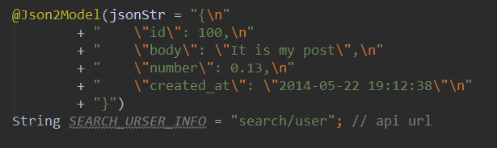
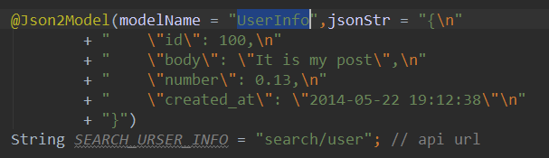
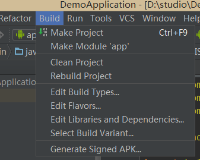
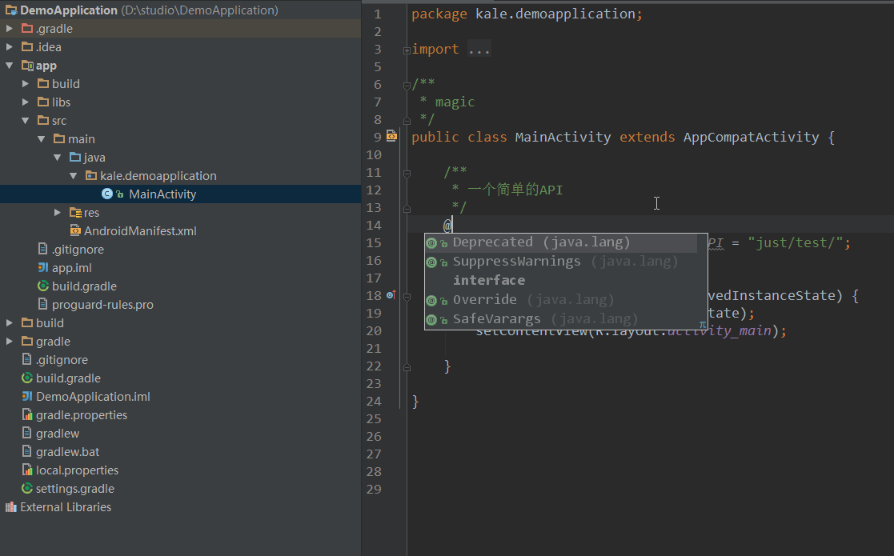
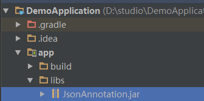

# JsonAnnotation  
JsonAnnotation can **speed up** Android development.It can generate Gson model class by json string.  

### Demo   
1.Copy url and jsonDemo into JsonAnnotation  
  
2.Just write a jsonModel name  
  
3.Build the project  
(->Make Project)  
  
Now you can use UserInfo to do something~  

**GIF Demo**  
Picture is big,wait a minute...  
  

### Usage  
1.Add apt  
```
	dependencies {
    	//...
        classpath 'com.neenbedankt.gradle.plugins:android-apt:1.7'
    }
```
2.Add apt plugin below `apply plugin: 'com.android.application'`  
```
apply plugin: 'android-apt'
```
3.add jsonAnnotation.jar in lib  
  


### Question  
```JAVA
@Json2Model(modelName = "UserInfo",jsonStr = "{\n"
            + "    \"id\": 100,\n"
            + "    \"body\": \"It is my post\",\n"
            + "    \"number\": 0.13,\n"
            + "    \"created_at\": \"2014-05-22 19:12:38\"\n"
            + "}")
    String SEARCH_URSER_INFO = "search/user"; // api url
```  

**1. Why we need build project?**  
Unfortunately,Android does not(yet)understand the concept of a compile-time-only dependency, so you need to mess with your build files to make it work.  

**2. Efficiency**  
@Json2Model will run in compile-time and models are created before generate apk file.Using JsonAnnotation, developers can let it generate the plumbing code at compile time.Reflect is not in this project,you don't worry about efficiency questions.  

**3. Where are models**  
@Json2Model will create models is out of your own project.You can find theme in:  
`app(your model name)/build/generated/source/apt/debug/...`  
You can edit these models by edit your jsonString.  

JsonAnnotation is less than 40kb,try it now~  


### Developer


Jack Tony: <developer_kale@.com>


### License

    Copyright 2015 Jack Tony

    Licensed under the Apache License, Version 2.0 (the "License");
    you may not use this file except in compliance with the License.
    You may obtain a copy of the License at

       http://www.apache.org/licenses/LICENSE-2.0

    Unless required by applicable law or agreed to in writing, software
    distributed under the License is distributed on an "AS IS" BASIS,
    WITHOUT WARRANTIES OR CONDITIONS OF ANY KIND, either express or implied.
    See the License for the specific language governing permissions and
    limitations under the License.
